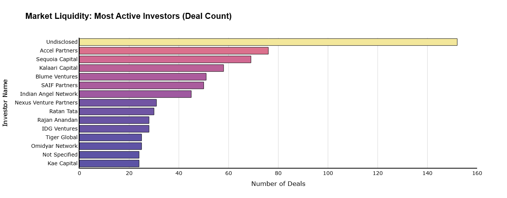
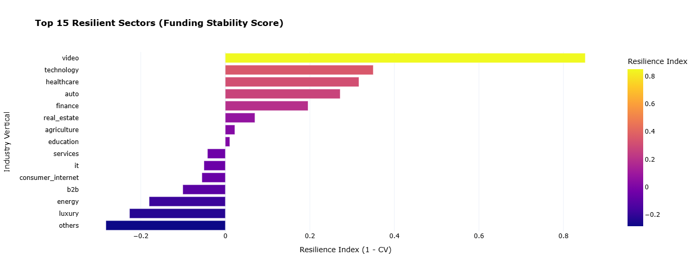

# Indian-Startup-Funding-Analysis

### Project Overview
This project performs an end-to-end deep-dive analysis into the Indian Startup Ecosystem (2015-2020). Dealing with real-world venture capital data often means facing "dirty" data—missing values, inconsistent naming, and encoding errors. I built a comprehensive pipeline to clean these records and used Machine Learning to predict missing funding amounts, allowing for a more accurate exploration of startup trends.

---

### The Data Engineering Pipeline

#### 1. Data Sanitization & Cleaning
The raw dataset contained significant noise. I implemented:
* **Encoding Recovery:** Resolved Latin-1 character artifacts and normalized Unicode text (NFKC).
* **Smart Name Extraction:** Used `tldextract` to pull startup names from URLs when the name field was missing.
* **Categorical Consolidation:** Grouped over 100+ fragmented industry sub-sectors into high-level verticals (Fintech, Edtech, Technology, etc.).

#### 2. Handling Missing Data (Predictive Imputation)
To avoid losing nearly 30% of the dataset due to missing funding values, I used:
* **Missingness Testing:** Conducted statistical tests (Logistic Regression) to see if missing data followed MAR (Missing at Random) patterns.
* **ExtraTrees Regressor:** Built a model to predict missing "Amount in USD" based on the Investor's history, the Sector, and the City. This used Log-Normal transformations to stabilize funding variance.

#### 3. Deduplication
* **Probabilistic Matching:** Used the Jaro-Winkler algorithm and `recordlinkage` to find startups with similar names (e.g., "Flipkart" and "Flipkart.com") to ensure our investment counts were accurate.

---

### Key Visual Insights

#### Market Liquidity: Most Active Investors

*A high-contrast analysis of the top 15 investors driving the most deals in the Indian market.*

#### Sector Maturity Heatmap

*This heatmap tracks deal frequency across different industries and years, highlighting the "peak" years for various sectors.*

#### Sector Resilience & Stability

*Using a custom Stability Score (1 - CV), this chart shows which industries had the most consistent funding year-over-year.*

---
